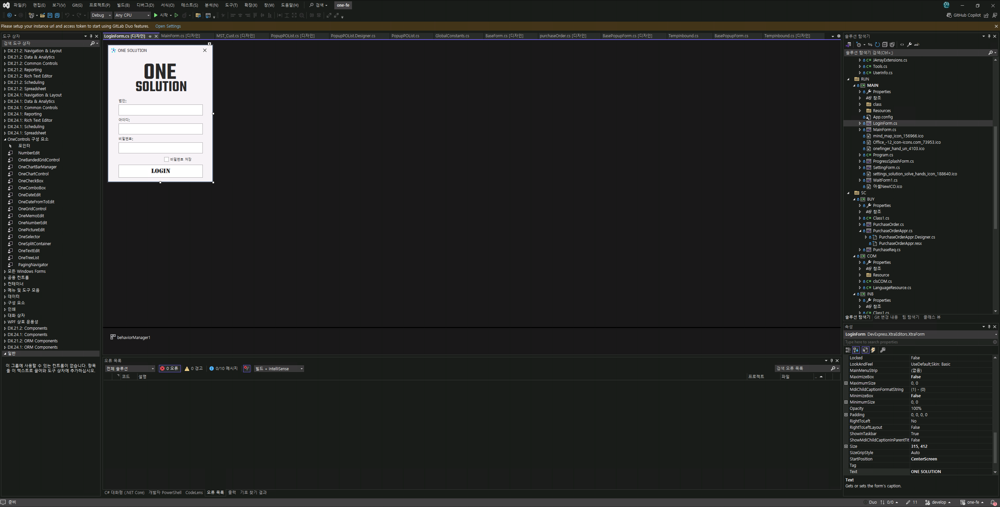
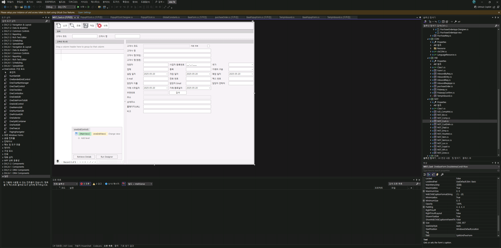
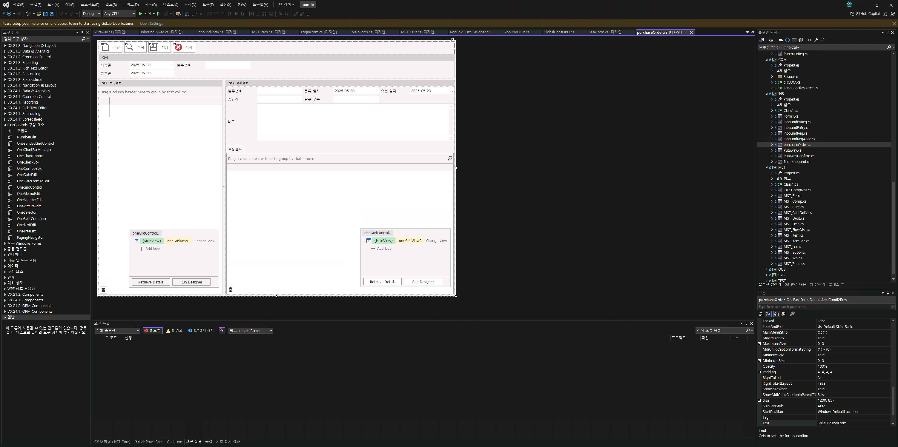
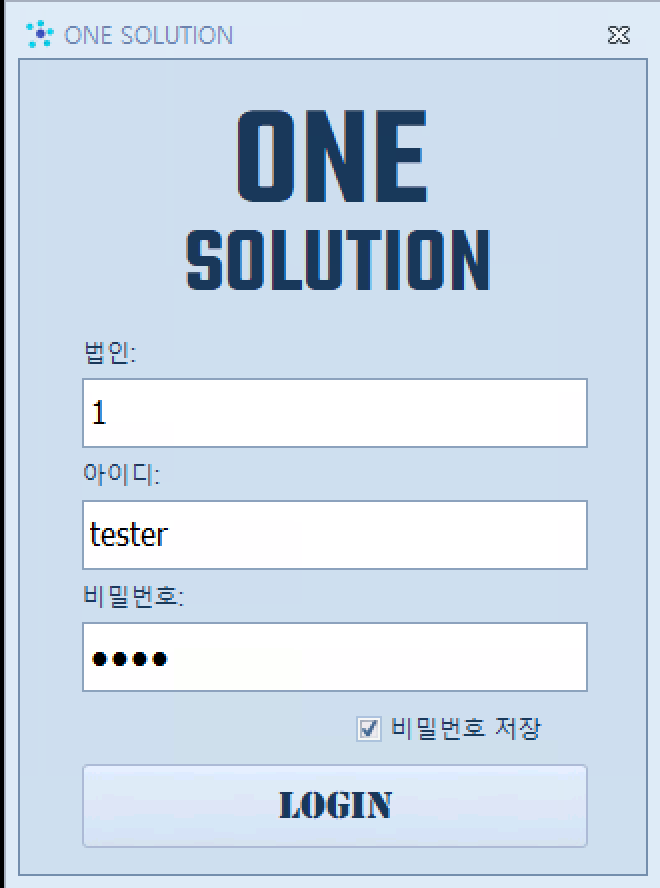
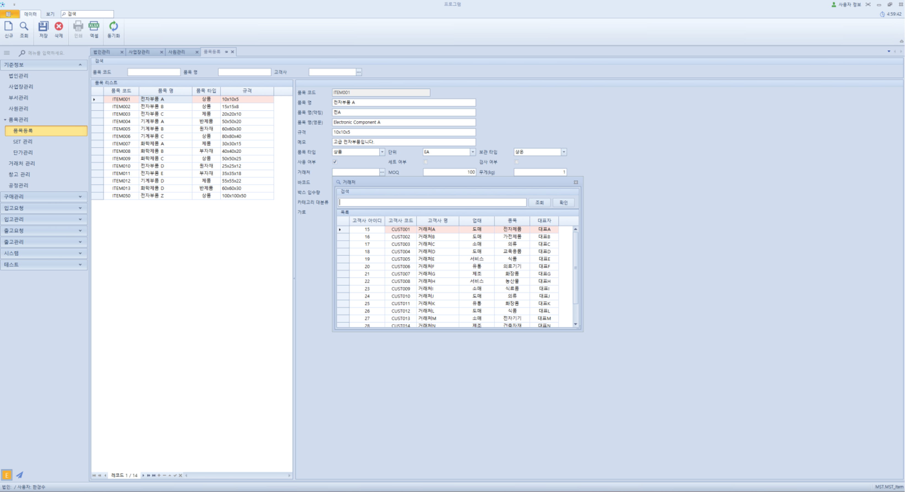
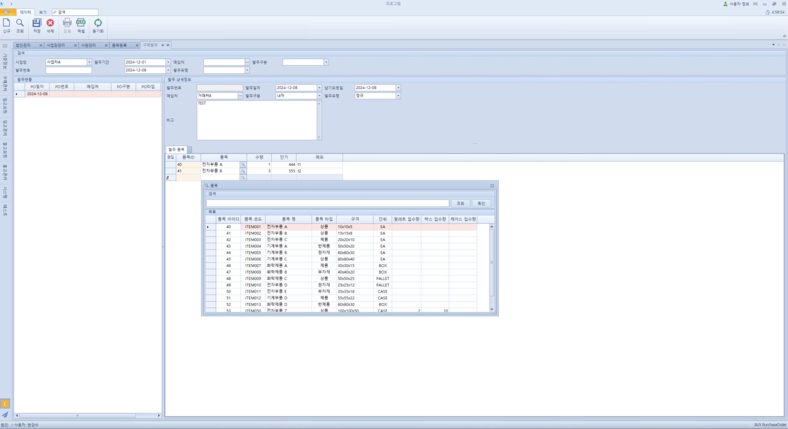
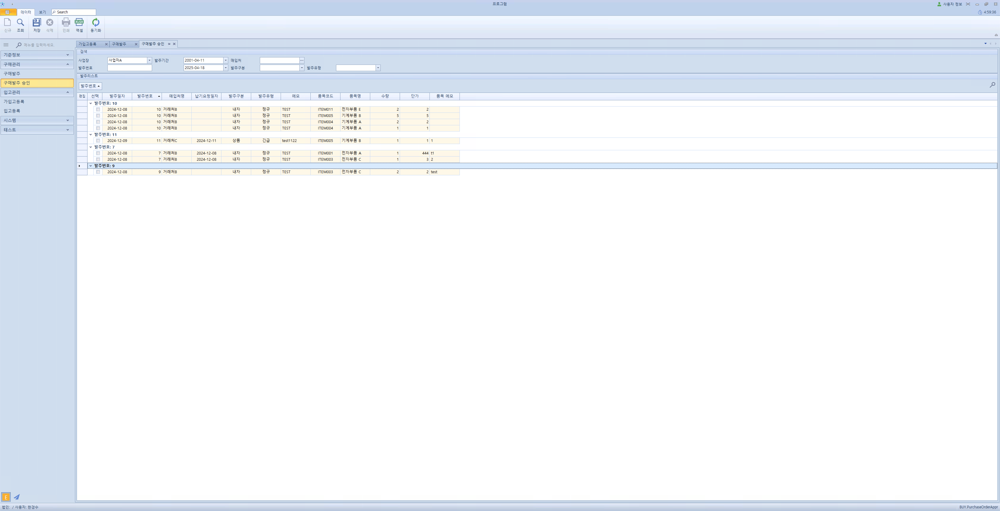

# 🛠️ One Solution 개발 환경

## ✅ 개요

**One Solution**은 **백엔드(Spring Boot)**와 **프론트엔드(C# WinForms)**로 구성된 하이브리드 업무 시스템 개발 프레임워크입니다.  
현장 중심의 빠른 요구 반영과 **개발 생산성 향상**을 목표로 설계되었으며,  
**Spring Boot 기반의 RESTful API 서버**와 **WinForms 기반의 데스크톱 클라이언트**가 효율적으로 연동되도록 구성되었습니다.

- **WinForms 프론트엔드**는 빠른 UI 구성과 사용자 친화적 환경 제공
- **Spring Boot 백엔드**는 유연한 확장성과 안정적인 API 처리 제공
- 실시간 데이터 처리를 위한 **경량 통신 구조** 채택
- **Swagger 연동**을 통해 API 명세 자동화 및 유지보수 용이

## 🌐 URL
- **프론트엔드 (C# WinForm) 다운로드:**  
  [https://one.solutionil.com](https://one.solutionil.com)
  
- **백엔드 (API 서버 - Swagger 문서):**  
  [https://one-api.solutionil.com/swagger-ui/index.html](https://one-api.solutionil.com/swagger-ui/index.html)

## 📌 Languages
- Java
- C#

## 📦 Framework
- Spring Framework
- Spring Boot 3.2
- MyBatis
- WinForms

## 🖥️ Environment
- Ubuntu
- Windows Server
- Nginx
- IIS
- Git
- Gradle

## 🚀 CI/CD
- GitLab (GitLab Runner)

## 🗄️ Database
- MariaDB

## 🧰 Tools
- Visual Studio 2022
- IntelliJ IDEA

## 🔧 ETC
- DevExpress (WinForms UI 컴포넌트)
- Swagger (API 문서화 도구)

## 🖼️ WinForms 개발 중 화면

> 개발 중인 C# WinForms 기반 클라이언트 UI 구성 예시입니다.

---

## 🖥️ 소프트웨어 실제 화면

> 실제 배포된 소프트웨어 UI 및 기능 구성 예시입니다.

